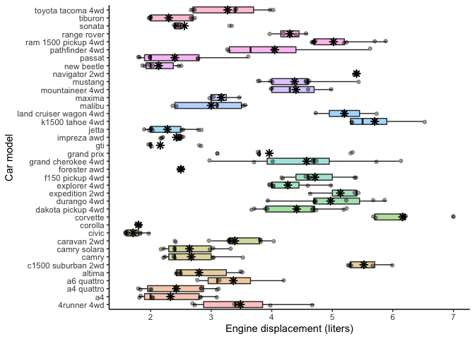

Assignment 1
================
Erick Navarro
1/11/2021

This assignment covers making a function in R, documenting it, and testing it.

## Setup

``` r
#Loading the required libraries
library(tidyverse)
library(testthat)
```

## Exercise 1 & 2 - Make a function (25 points) & Document the function (20 points)

For this exercise, I chose to do a function for a plot that I usually do: a boxplot with a jitterplot, using specific parameters and layers that I like.

``` r
#' Plot a boxplot with a jitterplot
#'
#' This function creates a boxplot with a jitter plot to observe the distribution of a numeric variable 
#' across one or more categorical variables. Furthermore, the mean is denoted as a black asterisk.
#' 
#'
#' @param dataset The dataset containing the variables for plotting in a tidy format. Names come from "dataset used to plot"
#' @param var_x Name of the column containing the categorical variable to be plot in x axis. Name comes from "variable x"
#' @param var_y Name of the column containing the numerical variable to be plot in y axi. Name comes from "variable y"
#' @param x_label,ylabel String indicating the name of the labels for x and y axis. Names come from "label of axis x or y"
#' @param alpha_boxplot,alpha_jitter Transparency parameter of the boxplot and jitterplot. Default is set to 0.3. Names come from "alpha of boxplot or jitterplot"
#' @param width_jitter Width parameter of the jitterplot. Default is set to 0.1. Name comes from "width of jitterplot"
#'
#' @return A ggplot2 histogram + jitter plot of a numerical variable with the mean marked as a black asterisk. 

box_jitter_plot <- function(dataset, 
                            var_x, 
                            var_y, 
                            x_label,
                            y_label,
                            alpha_boxplot = 0.3, 
                            alpha_jitter = 0.3, 
                            width_jitter = 0.1){
  arguments_list = list(var_y = pull(dataset, {{var_y}}),
                        alpha_boxplot = alpha_boxplot,
                        alpha_jitter = alpha_jitter,
                        width_jitter = width_jitter,
                        var_x = pull(dataset, {{var_x}}),
                        x_label = x_label,
                        y_label = y_label)

  #Check data types: numeric data  
  for(argument_name in c(names(arguments_list)[1:4])){
    if(!is.numeric(arguments_list[[argument_name]])){
      stop("Argument `", argument_name ,"` must be numeric. You input an object of class ", 
           class(arguments_list[[argument_name]]))
    }
  }
  
  #Check data types: characters/factors  
  for(argument_name in c(names(arguments_list)[5:7])){
    if(!is.character(arguments_list[[argument_name]]) && !is.factor(arguments_list[[argument_name]])){
      stop("Argument `", argument_name ,"` must be character or factor You input an object of class ", 
           class(arguments_list[[argument_name]]))
    }
  }
  
  #Produce the plot
  dataset %>% 
    filter(!is.na({{var_x}}),
           !is.na({{var_y}})) %>% 
    ggplot(aes( x = {{var_x}}, y = {{var_y}}, fill = {{var_x}})) +
    geom_boxplot(alpha = alpha_boxplot) +
    geom_jitter(alpha = alpha_jitter, width = width_jitter)+
    stat_summary(fun = mean, colour = "black", shape = 8) +
    theme_classic() +
    guides(fill = "none")+
    xlab(x_label) +
    ylab(y_label)

}
```

## Exercise 3 - Include examples (15 points)

To test by eye my function, I decided to use an already available dataset in r: `mpg`. Here, I plot the distribution of the engine displacement (variable `displ`) in the diferent car models (variable `model`).

``` r
box_jitter_plot(mpg, 
                var_x = model,
                var_y = displ,
                x_label = "Car model",
                y_label = "Engine displacement (liters)",
                alpha_boxplot = 0.4,
                alpha_jitter = 0.4,
                width_jitter = 0.15)
```


The plot was succesfully made. However, for this specific case, there are too many categorical variables in the x axis, which makes it hard to read them. This can be easily solved by adding an extra ggplot layer. This is a very useful example because you can observe that the output of the function is a ggplot object, which can be further modified to the user's convenience.

``` r
box_jitter_plot(mpg, 
                var_x = model,
                var_y = displ,
                x_label = "Car model",
                y_label = "Engine displacement (liters)",
                alpha_boxplot = 0.4,
                alpha_jitter = 0.4,
                width_jitter = 0.15)+
  coord_flip()
```



Furthermore, I tested that the errors were indicated sucesfully when an incorrect data type is input, as it canbe observed in the following code chunks

``` r
box_jitter_plot(mpg, 
                var_x = year, #This data type is numeric, not char or factor as it should be
                var_y = displ,
                x_label = "Car model",
                y_label = "Engine displacement (liters)",
                alpha_boxplot = 0.4,
                alpha_jitter = 0.4,
                width_jitter = 0.15)
```

    ## Error in box_jitter_plot(mpg, var_x = year, var_y = displ, x_label = "Car model", : Argument `var_x` must be character or factor You input an object of class integer

``` r
box_jitter_plot(mpg, 
                var_x = model, 
                var_y = displ,
                x_label = "Car model",
                y_label = "Engine displacement (liters)",
                alpha_boxplot = "high", #this is a character data type, instead of the expected numerical value
                alpha_jitter = 0.4,
                width_jitter = 0.15)
```

    ## Error in box_jitter_plot(mpg, var_x = model, var_y = displ, x_label = "Car model", : Argument `alpha_boxplot` must be numeric. You input an object of class character

## Exercise 4 - Test the function (25 points)

To have a more formal approach to test my function, I used the testthat package, testing 3 conditions that I expect from the the behaviour of its output.

``` r
#test that the outpot of the function is a ggplot
test_that("The output is not a ggplot object",
          {expect_true(is.ggplot(box_jitter_plot(dataset = iris, 
                                       var_x = Species, 
                                       var_y = Sepal.Length,
                                       x_label = "Iris species", 
                                       y_label = "Sepal length"))) #Test that the final output is a ggplot object
          expect_error(box_jitter_plot(dataset = iris, 
                                       var_x = Sepal.Length, 
                                       var_y = Sepal.Length,
                                       x_label = "Iris species", 
                                       y_label = "Sepal length")) #This should throw an error because var_x is supposed to be a categorical variable, not numerical  
          expect_error(box_jitter_plot(dataset = iris, 
                                       var_x = Sepal.Length, 
                                       var_y = Sepal.Length,
                                       x_label = 123, 
                                       y_label = "Sepal length")) #This should throw an error because x_lab is supposed to be a string, not a numerical value
          }
          )
```

    ## Test passed 🥳
